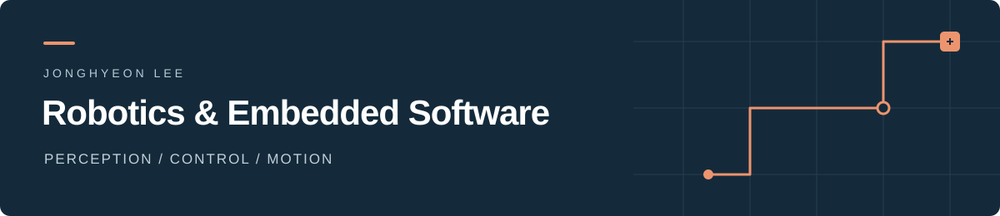

# 이종현 · Jonghyeon Lee

**센서 데이터를 이해하고, 제어 로직으로 연결하며, 실제 장비에서 동작을 확인합니다.**

ROS 2·Nav2 기반 이동로봇 주행, STM32 센서·모터 제어, Raspberry Pi 기반 온디바이스 AI를 개발합니다.

**[포트폴리오 보기 ↗](https://jonghyeon9084.github.io/)** · [Email](mailto:jonghyeon9084@gmail.com)

## Focus · 스마트팩토리

운반로봇 **2대**와 지게차 **1대**를 활용하는 공장 물류 자동화 프로젝트에서 **자율주행·정밀 도킹·상하차 연동**을 담당하고 있습니다.

- **구현:** ArUco 마커 정렬 → 저속 직진 → IR 센서의 검정 테이프 감지 → 실제 정지 확인으로 이어지는 독립 도킹
- **확인:** burger2 실물 도킹 동작 성공. 마커 검출과 IR 제어를 로봇 내부에서 수행
- **진행:** Nav2 도착 후 도킹 자동 연동, 전체 공정 통합 및 반복 정밀도 측정

[주행 구조와 도킹 구현 과정 →](https://jonghyeon9084.github.io/#factory)

## Selected projects

| 프로젝트 | 개인 담당 · 핵심 결과 | 상세 |
| :--- | :--- | :--- |
| **VisionPoseCoach · POCO** | 얼굴 특징 추출, GRU·TFLite 졸음 모델 개발. 2차에서 EOG 기반 데이터 고도화·모니터암 수평 제어 담당. **제24회 임베디드SW경진대회 결선 진출** | [1차](https://jonghyeon9084.github.io/#ai-one) · [2차](https://jonghyeon9084.github.io/#ai-two) |
| **STM32 물품 회수·운반 로봇** | 차량 하드웨어, MPU6050 보정·필터링, 상대 Yaw 기반 PID 직진·후진 제어 공동 개발 | [정리](https://jonghyeon9084.github.io/#stm) · [팀 코드](https://github.com/sditr0414/mobile-retrieval-robot) |
| **PLC 식품 분류·창고 관리** | Ladder 시퀀스·HMI 공동 개발. 복귀 위치·병렬 동작 최적화로 총 동작 시간 **173.3 → 152.8초 (11.8% 단축)** | [정리](https://jonghyeon9084.github.io/#plc) |

**POCO 코드:** [1차](https://github.com/jonghyeon9084/VisionPoseCoach-POCO-) · [2차 팀 저장소](https://github.com/HONEYDEV0310/2026ESWContest_free_POCO)

POCO 2차의 졸음 모델은 개선 중입니다. 프로젝트별 구현 범위와 검증 결과는 포트폴리오에 정리했습니다.

## Tech stack

| 분야 | 프로젝트에서 사용한 기술 |
| :--- | :--- |
| **Languages** | C · C++ · Python |
| **Robotics** | ROS 2 · Nav2 · SLAM · ArUco · Ubuntu |
| **Embedded & Control** | STM32 · Raspberry Pi · IMU · PID · I2C · PWM |
| **On-device AI** | OpenCV · MediaPipe · GRU · TFLite |
| **Automation** | Mitsubishi PLC · GX Works2 · Ladder · HMI |

---

**Contact** · [jonghyeon9084@gmail.com](mailto:jonghyeon9084@gmail.com)

프로젝트 구성, 담당 역할, 시연 자료는 [포트폴리오](https://jonghyeon9084.github.io/)에서 확인하실 수 있습니다.
